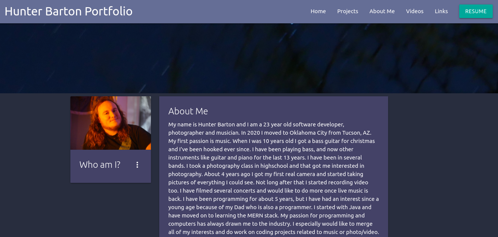

# React Portfolio

### Project Created By: Hunter Barton

## **Description**

A clean and modern looking portfolio made with React.

---

## **Table of Contents**

-  [Installation](#installation)
-  [Usage](#usage)
-  [License](#license)
-  [Contributing](#contributing)
-  [Tests](#tests)
-  [Questions](#questions)

---

## Installation

None. Just go to the Github Pages [link](https://mythosmystery.github.io/react-portfolio)

## Usage

Use the navigation bar to go to different sections of the site. The project screenshots can be clicked on to reveal more detailed information.

## Screenshots

## Configuring

N/A

## Technologies Used

---

-  React.js
-  create-react-app
-  materializeCSS
-  github pages

---

## Contributing

None
If you would like to add to this project, you can [follow me on GitHub](https://github.com/mythosmystery).

## Tests

None

## Questions:

If you have any questions about this project, you can reach me [on GitHub](https://github.com/mythosmystery)
or via email at axiysfire@gmail.com.

## License

Mozilla Public License

**React Portfolio created 07/16/2021, by Hunter Barton.**
